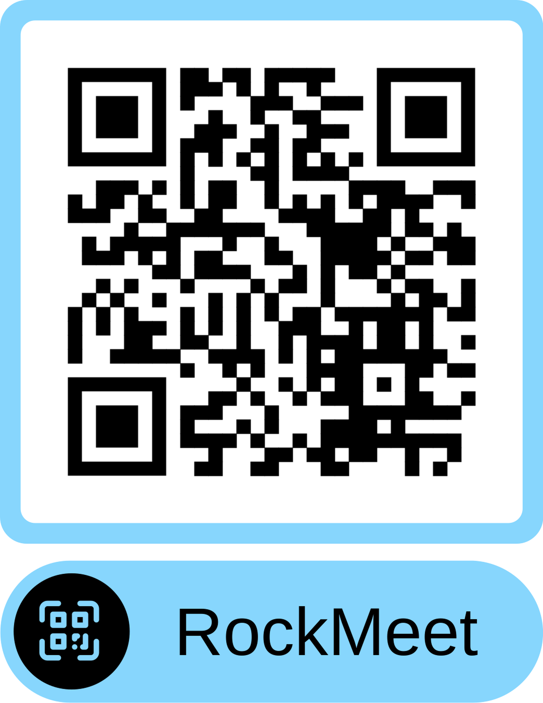

# 🎸 RockMeet

> **La red social del Instituto Roca** — conecta con compañeros de tu ciclo, descubre eventos, y encuentra personas con tus mismos intereses.

RockMeet es una aplicación móvil social construida con Flutter para los estudiantes del Institut Roca . Permite a los alumnos conectar entre sí mediante un sistema de matching por deslizamiento, chatear en tiempo real, apuntarse a eventos del centro y consultar el horario de su ciclo formativo.

---

## ✨ Funcionalidades implementadas

### 👤 Autenticación
- Registro con email, contraseña (mín. 8 caracteres, letra + número obligatorios), nombre, fecha de nacimiento y género
- Registro protegido por **código de acceso de 24 h** generado por el staff
- Login con email y contraseña
- **Recuperación de contraseña** vía enlace de email (Firebase Auth)
- Detección y pantalla de cuenta bloqueada
- Enrutamiento automático por tipo de usuario: `user` → Home, `staff` → Panel Staff

### 🏠 Home — Matching
- Tarjetas deslizables con animación de volteo (cara frontal / trasera)
- **Swipe derecha** → Like · **Swipe izquierda** → Pass
- Detección de match mutuo con animación de celebración
- Cara trasera: bio, género, ciclo formativo, galería de fotos y **links de redes sociales clicables**
- Filtrado de usuarios staff y de interacciones previas

### 👤 Perfil
- Edición de nombre, bio, avatar, galería (hasta 3 fotos), curso, intereses y redes sociales
- Selector de **ciclo formativo** completo (DAM, DAW, ASIX, SMX, AU, IDMN, HB, MP, EDI, Otro)
- **Botón de horario de clase** — aparece automáticamente si el staff ha subido el horario del ciclo del usuario
- Canción favorita con tarjeta estilo Spotify
- Estadísticas: Me gustas · Eventos · Amigos
- Links de redes sociales (Twitter/X, Instagram, TikTok, Spotify) con apertura externa

### 💬 Chat
- Chat directo en tiempo real entre usuarios con match
- Lista de conversaciones activas
- Vista del perfil del interlocutor desde el chat

### 🔔 Notificaciones
- Notificaciones en tiempo real (like, match, mensaje)
- Contador de no leídas en la barra de navegación
- Deslizar para eliminar notificación individual
- Botón para eliminar todas las notificaciones

### 🗓️ Eventos
- Listado de eventos activos y próximos
- Apuntarse / desapuntarse con control de aforo (transacción atómica Firestore)
- Sugerir eventos al staff para su aprobación

### ⚙️ Ajustes
- Cambiar contraseña
- Política de privacidad · Términos y condiciones · Preguntas frecuentes
- Contactar con soporte
- Cerrar sesión

### 🛠️ Panel Staff
- Dashboard con resumen de eventos (activos, totales, pendientes)
- Crear, editar, eliminar y cambiar el estado de eventos
- Aprobar o rechazar eventos sugeridos por usuarios
- **Gestionar Horarios de Clase** — subir y eliminar la imagen del horario por ciclo (con nombre completo del ciclo)
- Gestionar Usuarios (bloqueos, moderación)
- Mensajes de soporte con estados: sin leer / trabajando en ello / resuelto
- Código de acceso al registro (caduca en 24 h, copiable al portapapeles)
- Informes de actividad

---
## 📲 Descargar APK (Android)

Escanea el código QR para descargar directamente la APK de RockMeet en tu dispositivo Android:

<p align="center">
  
</p>

> Asegúrate de tener habilitada la opción **"Instalar aplicaciones de fuentes desconocidas"** en los
 ajustes de tu dispositivo.

---

## 🚀 Inicio rápido

### Requisitos
- Flutter **3.x** o superior
- Dart **3.x** o superior
- Android SDK (API 21+) o Xcode 14+
- Cuenta Firebase con Firestore + Authentication habilitados
- Cuenta Supabase con bucket de almacenamiento configurado

### Instalación

```bash
git clone https://github.com/Keviinbolo/rockmeet.git
cd RockMeet
flutter pub get
flutter run
```

> Los archivos `google-services.json` (Android) y `GoogleService-Info.plist` (iOS) no están incluidos en el repositorio por seguridad. Configura tu propio proyecto Firebase y colócalos en las carpetas correspondientes.

---

## 🛠️ Stack tecnológico

| Tecnología | Uso |
|---|---|
| **Flutter 3 / Dart 3** | Framework de UI multiplataforma |
| **Firebase Authentication** | Login, registro y recuperación de contraseña |
| **Cloud Firestore** | Base de datos en tiempo real |
| **Supabase Storage** | Almacenamiento de imágenes (perfil, galería, horarios) |
| **Google Fonts** | Tipografía (`Outfit`) |
| `url_launcher` | Apertura de links externos |
| `image_picker` | Selección de imágenes desde galería |
| `intl` | Formato de fechas y horas |

---

## 📱 Pantallas principales

| Pantalla | Archivo | Estado |
|---|---|---|
| Splash / enrutamiento | `portal_auth.dart` | ✅ |
| Login | `login.dart` | ✅ |
| Registro | `registro_page.dart` | ✅ |
| Configuración inicial del perfil | `profile_setup_page.dart` | ✅ |
| Home — Matching | `home_page.dart` | ✅ |
| Perfil | `Perfil.dart` | ✅ |
| Chat | `chat_page.dart` | ✅ |
| Eventos | `event_screen.dart` | ✅ |
| Notificaciones | `notifications_page.dart` | ✅ |
| Likes recibidos | `like_page.dart` | ✅ |
| Ajustes | `ajustes.dart` | ✅ |
| Panel Staff | `home_staff_page.dart` | ✅ |
| Gestionar Horarios | `staff_schedule_page.dart` | ✅ |
| Gestionar Usuarios | `staff_user_management_page.dart` | ✅ |
| Cuenta bloqueada | `blocked_user_screen.dart` | ✅ |

---

## 🏗️ Arquitectura

La aplicación sigue una arquitectura **feature-based** con separación clara entre lógica compartida (`core/`) y módulos funcionales (`features/`).

```
lib/
├── config/         # Rutas, tema y constantes de diseño
├── core/           # Servicios, modelos y widgets reutilizables
└── features/       # Módulos: auth, home, chat, profile, events…
```

Consulta [`lib/core/doc/ARCHITECTURE.md`](lib/core/doc/ARCHITECTURE.md) para la documentación técnica detallada.

---

## 👥 Público objetivo

Estudiantes y personal docente del **Institut Roca** (Viladecans) — ciclos formativos de grado superior y medio.

---

## 🐛 Reportar bugs

Usa el apartado de **Issues** del repositorio o consulta la plantilla en `lib/core/doc/crashes/`.

---

## 📝 Licencia

Proyecto académico publicado bajo licencia **MIT**.  
Consulta el archivo `LICENSE` para más información.
